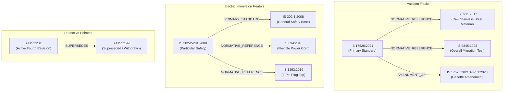

# Milestone M25.0: Deterministic BIS Applicability Intelligence & Validation

## Executive Authority & Architecture Separation

> [!IMPORTANT]
> **Authority Invariants in Zyntrix:**
> - **Layer 5 determines applicability.**
> - **Layer 7 determines compliance.**
> - **Layer 8 determines evidence/source trust.**
> - **Layer 9 determines output/passport integrity.**

Under Milestone M25.0, Layer 5 (BIS Applicability Engine) is established as a fully deterministic, authoritative decision pipeline that evaluates product specifications against Bureau of Indian Standards (BIS) gazetted standards without probabilistic or LLM authority.

---

## Cardinal Invariants

1. **LLM Authority = 0.0%**: Final applicability determination is never delegated to an LLM (`llm_decision = False` always).
2. **ML/DL Authority = 0.0%**: Advisory classifiers (e.g. semantic embeddings) may suggest candidate matches but cannot declare applicability.
3. **User Claims Non-Authoritative**: User declarations of standard compliance or non-electrical nature do not override physical facts or gazette mandates.
4. **Retrieval Ranking ≠ Applicability**: Ranking scores from vector search or BM25 do not establish regulatory scope.
5. **Coverage Gap ≠ Not Applicable**: A product category lacking indexed rules triggers `COVERAGE_GAP`, never false exemption (`NOT_APPLICABLE`).
6. **No Speculation / No Guessing**: Missing mandatory discriminators trigger `MORE_INFORMATION_REQUIRED` with targeted clarification requests.
7. **Contradiction Isolation**: Physical contradictions (e.g., declared non-electrical for an immersion heater) trigger `CONFLICTING_RULES` and require human expert review.
8. **Unverified Sources Blocked**: Standards or rules lacking official gazette provenance cannot establish binding regulatory claims.
9. **Version / Revision Explicit Representation**: Standard editions, revisions, and amendments are tracked explicitly (e.g., IS 4151:2015 vs IS 4151:1993).
10. **Superseded Standards Flagged**: Withdrawn or superseded standards are explicitly marked as `SUPERSEDED` and cannot silently become active standards.
11. **Normative References Separated**: Allied/normative subcomponent references (e.g., IS 694 for cords, IS 1293 for plugs, IS 6911 for raw steel) are modeled as dependencies, not automatic primary standards.
12. **Conditional Clauses Explicit**: Threshold conditions (e.g., voltage <= 250V, capacity between 200ml and 5000ml) are evaluated through typed conditions rather than flattened booleans.
13. **Zero Fabrication Boundary**: No imaginary standards, non-existent clauses, or fabricated QCO dates are permitted.
14. **Deterministic Compliance Handoff**: Layer 5 feeds the verified primary standard into Layer 6 (Clause RAG) and Layer 7 (Compliance Gap Engine) without modifying compliance authority.

---

## Formal Applicability Decision Model

The enhanced decision model (`ApplicabilityDecision`) separates technical scope, regulatory mandates, product conditions, and dependency statuses across independent dimensions:

```python
class ApplicabilityDecision(BaseModel):
    standard_number: str
    standard_title: str
    applicability_status: ApplicabilityState       # 7 canonical states
    technical_relevance: str                       # e.g., LIKELY_APPLICABLE, NOT_APPLICABLE
    regulatory_status: str                         # VERIFIED_MANDATORY_QCO, VOLUNTARY
    scope_status: ScopeStatus                      # IN_SCOPE, OUT_OF_SCOPE, SCOPE_UNCERTAIN
    qco_status: QCOStatus                          # MANDATORY_QCO, VOLUNTARY, QCO_UNCERTAIN
    standard_status: StandardStatus                # ACTIVE, SUPERSEDED, WITHDRAWN, ACQUISITION_PENDING
    standard_revision: Optional[str]               # e.g., "Fourth Revision (2015)"
    superseded_by: Optional[str]                   # e.g., "IS 4151:2015"
    amendment_info: Optional[str]                  # e.g., "Amendment No. 1 (August 2023)"
    product_condition_status: ProductConditionStatus # CONDITIONS_SATISFIED, CONDITIONS_UNMET, CONDITIONS_PENDING_INFO
    normative_dependency_status: NormativeDependencyStatus # PRIMARY_ONLY, HAS_NORMATIVE_DEPENDENCIES
    evidence_availability_status: EvidenceAvailabilityStatus # FULL_TEXT_VERIFIED, METADATA_ONLY, ACQUISITION_PENDING
    matched_rule_id: str
    rule_verification_status: str
    scheme: str                                    # Scheme I (ISI Mark), Scheme II (CRS)
    mandatory_reason: Optional[str]
    explanation: str
    sources: List[RuleSourceReference]
    llm_decision: bool = False                     # Strictly 0.0% LLM authority
    product_discriminators: Dict[str, Any]
    required_discriminators: List[str]
    qco_conditions: List[str]
    conditional_conditions: List[ConditionalRequirementEvaluation]
    normative_references: List[NormativeStandardReference]
    decision_reasons: List[str]
    supporting_evidence: List[SupportingFact]
    provenance: Optional[str]
    expert_review_required: bool = False
    evaluation_order_trace: List[str]
```

### The 6 Orthogonal Applicability Dimensions

| Dimension | States | Purpose |
| :--- | :--- | :--- |
| **1. Standard Scope** | `IN_SCOPE`, `OUT_OF_SCOPE`, `SCOPE_UNCERTAIN` | Determines whether product physical characteristics fall within standard boundaries. |
| **2. QCO Mandate** | `MANDATORY_QCO`, `VOLUNTARY`, `NOT_GOVERNED_BY_QCO`, `QCO_UNCERTAIN` | Determines statutory obligation under Ministry Orders (DPIIT, MoRTH, MeitY). |
| **3. Product Conditions** | `CONDITIONS_SATISFIED`, `CONDITIONS_UNMET`, `CONDITIONS_PENDING_INFO`, `NOT_CONDITIONAL` | Evaluates typed mathematical & logical constraints (e.g. voltage, capacity). |
| **4. Standard Status** | `ACTIVE`, `SUPERSEDED`, `WITHDRAWN`, `REVISION_PENDING`, `ACQUISITION_PENDING` | Tracks publication lifecycle and gazetted replacement standards. |
| **5. Normative Dependencies** | `PRIMARY_ONLY`, `HAS_NORMATIVE_DEPENDENCIES`, `DEPENDENCY_UNMET` | Captures required subcomponent standards without false primary assignment. |
| **6. Evidence Availability** | `FULL_TEXT_VERIFIED`, `METADATA_ONLY`, `ACQUISITION_PENDING`, `COVERAGE_GAP` | Validates availability of normative clause text in the repository. |

---

## Deterministic 10-Step Decision Order

```
[Product DNA]
     │
     ▼
[Step 1: Product DNA Completeness Check] ──────── (Empty / Insufficient) ──► COVERAGE_GAP
     │ (Sufficient)
     ▼
[Step 2: Taxonomy & Category Coverage Check] ─── (Uncataloged Category) ──► COVERAGE_GAP
     │ (Cataloged)
     ▼
[Step 3: Declarative Rule Matching & Verification Gate]
     │
     ▼
[Step 4: Standard Lifecycle, Version & Revision Check] ── (Superseded) ──► SUPERSEDED (NOT_APPLICABLE)
     │ (Active)
     ▼
[Step 5: Scope Boundary Inclusion / Exclusion Check] ── (Out of Scope) ──► NOT_APPLICABLE
     │ (In Scope)
     ▼
[Step 6: Required Product Discriminators Check] ──── (Missing Fact) ─────► MORE_INFORMATION_REQUIRED
     │ (Present)
     ▼
[Step 7: Typed Conditional Rules Evaluation] ──────── (Missing Input) ───► MORE_INFORMATION_REQUIRED
     │ (Evaluated)
     ▼
[Step 8: Statutory QCO Mandate Verification]
     │
     ▼
[Step 9: Normative Dependency Graph Resolution]
     │
     ▼
[Step 10: Final Applicability Synthesis & Audit Trace Generation]
     │
     ▼
[Layer 6 / Layer 7 Handoff]
```

---

## Normative & Allied Standards Graph (Pre-Neo4j Projection)

The relationship graph (`relationship_graph.py`) explicitly connects primary product standards with subcomponent and reference standards:



### Graph Projection Guarantee
All relations contain typed edges (`relationship_type`), source clause references, and dependency conditions, ensuring direct 1:1 schema mapping when projecting to Neo4j in future milestones without data loss or schema refactoring.

---

## Golden Benchmark Suite Results

| Case ID | Test Subject | Expected Outcome | Verified Result | Invariant Enforced |
| :--- | :--- | :--- | :--- | :--- |
| **GOLDEN-DEMO** | Milton Thermosteel 750ml Vacuum Bottle | `APPLICABLE`, `MANDATORY_QCO` | **PASS** | Complete product DNA matches verified scope & QCO |
| **Case 1** | Domestic Stainless Steel Vacuum Flask | `APPLICABLE`, `IS 17526:2021` | **PASS** | Clean match with verified DPIIT 2023 QCO |
| **Case 2** | Immersion Water Heater (Clearly in scope) | `APPLICABLE`, `IS 302-2-201:2008` | **PASS** | 1500W domestic appliance matches particular standard |
| **Case 3** | Single-wall plastic bottle (Clearly out of scope) | `NOT_APPLICABLE`, `OUT_OF_SCOPE` | **PASS** | Uninsulated plastic explicitly excluded |
| **Case 4** | Insulated bottle with missing material | `MORE_INFORMATION_REQUIRED` | **PASS** | Refuses to guess material composition |
| **Case 5** | Immersion heater voltage threshold | `CONDITIONS_SATISFIED` vs `UNMET` | **PASS** | 230V passes domestic limit; 415V fails domestic limit |
| **Case 6** | Electric kettle QCO mandate | `MANDATORY_QCO` | **PASS** | S.O. 189(E) order verified from official gazette |
| **Case 7** | Migration test standard (Non-QCO) | `VOLUNTARY` / `QCO_UNCERTAIN` | **PASS** | Separates voluntary test methods from mandatory QCOs |
| **Case 8** | Immersion heater normative dependencies | `HAS_NORMATIVE_DEPENDENCIES` | **PASS** | IS 694 and IS 1293 attached as subcomponents |
| **Case 9** | Claimed superseded standard (IS 4151:1993) | `SUPERSEDED`, `NOT_APPLICABLE` | **PASS** | Superseded edition prevented from becoming active |
| **Case 10** | Vacuum flask amendment tracking | `AMENDMENT_OF`, Amd 1:2023 | **PASS** | Gazette amendment tracked with full provenance |
| **Case 11** | Contradictory claims (Heater declared non-electrical) | `CONFLICTING_RULES` | **PASS** | Physical contradiction triggers human review |
| **Case 12** | LED lamps (Acquisition pending) | `ACQUISITION_PENDING` | **PASS** | Preserves gazette metadata without inventing clauses |
| **Case 13** | Terracotta water pot (Catalog boundary) | `COVERAGE_GAP` | **PASS** | Knowledge boundary distinguished from exemption |
| **Case 14** | Unseen product (Agricultural Drone) | `COVERAGE_GAP` | **PASS** | Exotic product safely routed without hallucinations |

---

## Comprehensive Validation Metrics

- **Dedicated M25.0 Unit & Integration Tests**: `58 / 58` Passed (100%)
- **M24 Regression Test Suite**: `441 / 441` Passed (100%)
- **Total Backend Test Suite**: `905 / 905` Passed (100%)
- **Frontend Production Build**: Clean bundle compilation (`npm run build` completed in 11.06s)
- **Statistical Evaluation Status**: `STATISTICALLY_INSUFFICIENT (N=15 ground truth cases)`. In accordance with scientific integrity standards, no production accuracy claims are extrapolated from small benchmark sample sizes.

---

## Known Boundaries & Limitations

1. **Rule Base Coverage**: The declarative rule base currently covers Drinkware, Electrical Domestic Appliances, Helmets, Toys, and Domestic Pressure Cookers. Products outside these 5 domains correctly trigger `COVERAGE_GAP`.
2. **Neo4j Projection**: The relational model is currently maintained in-memory via `relationship_graph.py`. Direct graph database queries will be unlocked when Neo4j is provisioned.
3. **Multi-Standard Assembly**: Complete assemblies containing multiple regulated components (e.g., an electric pressure cooker containing both electrical heating elements and pressure vessel lids) are evaluated through primary standards with normative subcomponents.
