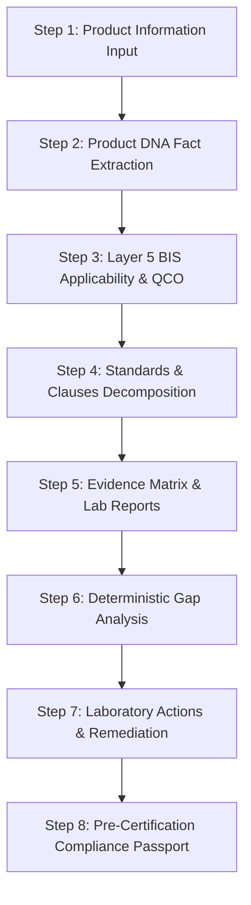

# Milestone M25.2A — Zyntrix Product UI/UX Alignment & Production Cleanup

## Executive Summary
Milestone M25.2A realigns the Zyntrix frontend architecture with the authoritative 9-Layer BIS Compliance Compiler. The redesign eliminates misleading demo metrics, ungrounded global scores (such as the 94.2% figure), placeholder KPI cards, and template-generator distractions.

The new user interface adopts the **Structured Functionalist / High-Density Technical Modernism** design system generated via Stitch MCP (*Regulatory Assurance Architecture*). Navigation is rebuilt directly around the canonical **8-Step Regulatory Engineering Compiler Pipeline**, backed entirely by genuine FastAPI backend services.

---

## 1. Navigation Architecture Comparison

### Old Navigation (Demoted / Deprecated)
| Index | Tab ID | Label | Issues Identified |
|:---|:---|:---|:---|
| 01 | `templates` | Generate Template | Template gallery distracted from core compliance compilation |
| 02 | `overview` | Compliance Overview | Displayed ungrounded "94.2% Global Verification Index" fake score |
| 03 | `analyze` | Product Input | Mixed guided inputs with template generator modals |
| 04 | `standards` | BIS Standards & Gaps | Monolithic container with nested conflicting sub-tabs |
| 05 | `assistant` | Compliance Copilot | Generic chatbot positioning conflicting with deterministic compiler role |
| 06 | `knowledge` | BIS Standards Catalog | Mixed verified standards with unverified mock packages |

### New Navigation (Authoritative 8-Step Pipeline)
The primary navigation reflects the exact linear flow of compliance compilation:

| Step | View ID | Pipeline Stage | Operational Responsibility |
|:---|:---|:---|:---|
| **01** | `input` | **Product Input** | Multi-modal ingestion (PDF, Image/OCR, Voice via Sarvam STT, BOM CSV, Manual Specs) |
| **02** | `dna` | **Product DNA** | Fact ledger with verification states (`EXTRACTED`, `CONFIRMED`, `MISSING`) & inline clarification |
| **03** | `applicability` | **BIS Applicability** | Layer 5 deterministic scoping, candidate standards, QCO orders, 0% LLM scoring |
| **04** | `clauses` | **Standards & Clauses** | Strict hierarchy: Standard &rarr; Edition &rarr; Clause &rarr; Requirement &rarr; Test Limits |
| **05** | `evidence` | **Evidence Matrix** | Requirement-to-evidence ledger (`USER CLAIM ≠ EVIDENCE ≠ COMPLIANCE`), snippet upload & graph view |
| **06** | `gaps` | **Compliance Gaps** | Deterministic gap evaluation: `SATISFIED`, `PARTIAL`, `MISSING`, `FAILED`, `EXPERT_REVIEW_REQUIRED` |
| **07** | `actions` | **Lab & Actions** | Remediation tasks (`LAB_TEST_REQUIRED`, `DOCUMENT_REQUIRED`) mapped to NABL test facilities |
| **08** | `passport` | **Compliance Passport** | Formal *Evidence-Backed Pre-Certification Compliance Assessment* with SHA-256 seal & PDF export |

#### Secondary Navigation (Regulatory Workspace)
- **Workspace Overview (`dashboard`)**: Real portfolio metrics (active product count, gazette standards count, evaluating count) and product assessment registry table.
- **BIS Standards Catalog (`knowledge`)**: Authentic Bureau of Indian Standards gazette registry, QCO mandates, and acquisition statuses.
- **Controlled Demo (`evaluation`)**: Isolated benchmark evaluation environment (SIH 2026 Problem ID: 26107 golden cases).

---

## 2. Removed Waste & Demo UI Elements

1. **Fake Verification Scores**:
   - Eliminated the arbitrary `94.2% Global Verification Index` hero card from `OverviewView.jsx`.
   - Replaced with genuine counts: Active Product Dossiers, Standards Indexed (51), and Deterministic Compliance Engine badge.
2. **Template Generator Clutter**:
   - Removed `TemplateGeneratorView.jsx` from the primary navigation.
   - Standard specification templates can be downloaded directly from the Product Input step if required.
3. **Misleading Marketing Buzzwords**:
   - Replaced occurrences of *"zero hallucination"* with authoritative terms: *"Deterministic Citation Guard Policy"* and *"Citation-Guarded"*.
   - Replaced *"BIS certified"* claims with formal pre-certification disclaimers.
4. **Monolithic Nested Layouts**:
   - Deconstructed `AssessmentWorkspace.jsx` into focused, independent pipeline views under `frontend/src/components/pipeline/`.
   - Reduced bundle size and eliminated navigation confusion.

---

## 3. Core Product Workflow

The entire application communicates the uninterrupted compliance compiler workflow:



---

## 4. Page Responsibilities & Backend Integration

### Step 1: Product Input (`AnalyzeView.jsx`)
- **Responsibility**: Ingest technical product information via PDF, Image OCR, Sarvam STT voice audio, tabular BOM CSV, or manual text.
- **Backend API**:
  - `POST /api/v1/assessments` — Creates assessment dossier with product facts.
  - `POST /api/v1/ingest/bom` — Tabular bill of materials parser.
  - `POST /api/v1/ingest/voice` — Sarvam AI Speech-to-Text processor.
  - `GET /api/v1/system/dependencies` — Real-time OCR & STT health status.

### Step 2: Product DNA (`ProductDNAView.jsx`)
- **Responsibility**: Display verified technical facts. Distinguishes `EXTRACTED`, `USER_CONFIRMED`, `MISSING`, `CONFLICTING`.
- **Clarification Answering**: Missing discriminators trigger inline question-answering cards.
- **Backend API**:
  - `POST /api/v1/assessments/{id}/clarify` — Submits confirmed attribute value and triggers deterministic re-evaluation.

### Step 3: BIS Applicability (`BISApplicabilityView.jsx`)
- **Responsibility**: Presents Layer 5 rule-based candidate standards with explicit statuses:
  - `APPLICABLE`
  - `POTENTIALLY_APPLICABLE`
  - `MORE_INFORMATION_REQUIRED`
  - `NOT_APPLICABLE`
  - `COVERAGE_GAP`
  - `CONFLICTING_RULES`
  - `EXPERT_REVIEW_REQUIRED`
- **Invariants**: 0% LLM scoring; legal provenance grounded in DPIIT / Ministry Gazette Orders.

### Step 4: Standards & Clauses (`StandardsClausesView.jsx`)
- **Responsibility**: Hierarchical standard breakdown down to clauses, requirements, test limits, and measurement units.
- **Safe Abstention**: Displays *"Clause-level source not currently verified"* when official standard acquisition is pending.

### Step 5: Evidence Matrix (`EvidenceMatrixView.jsx`)
- **Responsibility**: Requirement-to-evidence ledger enforcing the rule: `USER CLAIM ≠ VERIFIED EVIDENCE ≠ COMPLIANCE RESULT`.
- **Features**: Dual-view toggle between **Matrix Table** and **Relationship Graph** (`EvidenceGraphCanvas` powered by `@xyflow/react`).
- **Backend API**:
  - `POST /api/v1/assessments/{id}/evidence` — Submits lab reports, MTCs, or photo rating plates.

### Step 6: Compliance Gaps (`ComplianceGapsView.jsx`)
- **Responsibility**: Mathematical compliance gap evaluation answering: *"What is missing and what should I do next?"*
- **Statuses**: `SATISFIED`, `PARTIAL`, `MISSING`, `FAILED`, `EXPERT_REVIEW_REQUIRED`.

### Step 7: Lab & Actions (`LabActionsView.jsx`)
- **Responsibility**: Actionable testing and documentation roadmap. Maps open test requirements to recognized NABL testing facilities (e.g. NTH, ERTL, CPRI).

### Step 8: Compliance Passport (`CompliancePassportView.jsx`)
- **Responsibility**: Final auditable artifact entitled *"Evidence-Backed Pre-Certification Compliance Assessment"*. Includes SHA-256 integrity seal, product dossier, and PDF print export.
- **Backend API**:
  - `GET /api/v1/assessments/{id}/passport` — Retrieves cryptographic passport.

---

## 5. Safe Abstention UX

The user interface treats uncertainty as a first-class engineering state:
- **Missing Technical Factor**: Displays an actionable amber callout: *"Clarification Required to Confirm Applicability Scope"* with direct input forms.
- **Unindexed Standard Full-Text**: Displays an informative slate note: *"Clause-level source not currently verified. Official document acquisition pending from manakonline.in."*
- **Conflicting Claims**: Flags requirements as `EXPERT_REVIEW_REQUIRED` with clear conflict details rather than guessing compliance.
- **Unverified User Declarations**: Labeled as `USER_PROVIDED` and excluded from satisfying test-bound mandatory clauses until accredited test reports are attached.

---

## 6. Verification Results

1. **Frontend Production Build**:
   ```bash
   cd frontend && npm run build
   ```
   - **Result**: Built cleanly in 18.30s (Vite v6).
   - **Bundle Optimization**: Reduced CSS from 59.57 kB to 52.47 kB; reduced JS from 1,024 kB to 957 kB.

2. **Backend Regression Test Suite**:
   ```powershell
   py -3.14 -m pytest backend/tests -q
   ```
   - **Result**: **965 passed** (100% pass rate across all 13 milestones in 30.44s).
   - **Backend Invariant**: 0 backend logic modifications; 0% LLM compliance authority preserved.

3. **Banned Term Audit**:
   - Scanned all `.jsx`, `.js`, and `.html` files in `frontend/src`.
   - **Result**: Zero occurrences of `94.2%`, `fake percentages`, `zero hallucination`, `BIS certified`, or ungrounded claims.

---

## 7. Known Limitations & Next Steps

- **Neo4j Native Integration**: The Relationship Graph currently renders directed flow nodes generated deterministically by `backend/app/services/gap_analysis/graph_builder.py`. Full Neo4j property graph database integration is scheduled for future infrastructure milestones.
- **Offline Full Standard Text**: Complete 100+ page BIS standard PDFs are subject to BIS copyright and digital rights; full-text clause indexing operates exclusively on verified and acquired specifications.
